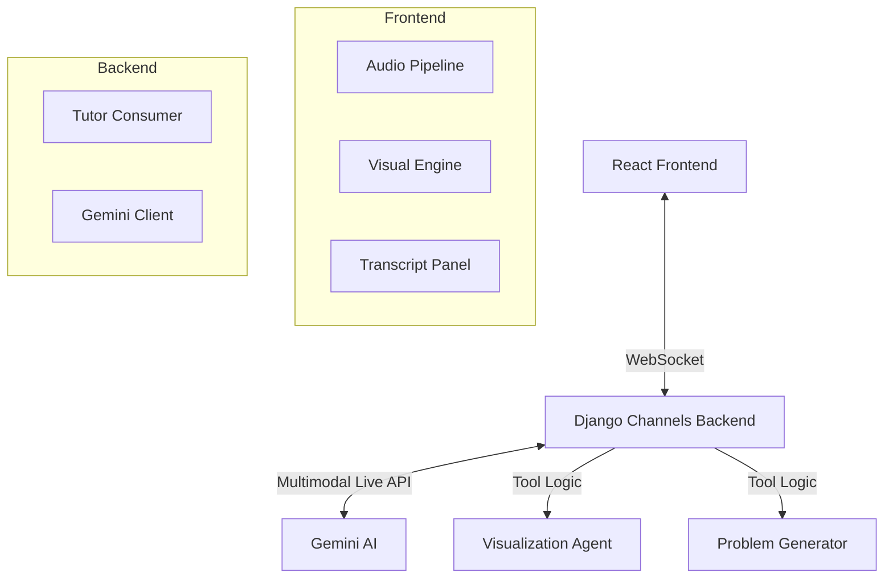

# Multimodal AI Mathematics Tutor 🎓📐

An advanced, real-time AI tutoring platform that leverages the **Gemini Multimodal Live API** to provide an interactive, voice-first learning experience. The system combines high-fidelity audio, real-time transcription, and dynamic mathematical visualizations to simulate a one-on-one lesson with a human tutor.

## 🌟 Key Features

- **Voice-First Interaction**: Natural, low-latency bidirectional audio conversation.
- **Multi-Agentic Architecture**: Orchestrated agents for tutoring, visualization, and problem generation.
- **Dynamic Visuals**: Real-time rendering of graphs, geometry, equations, and charts that evolve with the conversation.
- **Multimodal Feedback**: The AI "sees" what it renders and can reference specific visual elements during its explanation.
- **Seamless Interruptions**: Natural barge-in capability where the AI stops immediately when the user speaks.
- **3D & Interactive Plots**: Support for advanced visualizations using Three.js and Plotly.

---

## 🏗️ System Architecture

The system follows a modern decoupled architecture with a focus on real-time synchronization.

### 1. The Frontend (React + Vite)
- **Audio Pipeline**: Manages the `AudioContext` and `AudioWorklet` for capturing microphone input (16kHz PCM) and playing back tutor responses (24kHz PCM).
- **Web Worker**: Offloads WebSocket communication to a background worker to ensure UI fluidity.
- **Visual Engine**: A responsive rendering layer using **Framer Motion**, **Recharts**, **Three.js**, and **Plotly** to animate mathematical concepts.

### 2. The Backend (Django Channels)
- **WebSocket Gateway**: Handles persistent connections from clients and bridges them to the Gemini API.
- **Tool Interception**: Intercepts function calls from Gemini (e.g., `generate_math_visual`) to trigger specialized sub-agents before returning the result to the main AI.

---

## 🤖 Multi-Agentic System

The platform operates using a hierarchy of specialized agents:

### 🎓 The Tutor Agent (Gemini 2.5 Flash Live)
The primary interface. It holds the "brain" of the session, maintaining the persona of a patient, encouraging tutor. It manages the conversation flow and decides when a concept needs a visual aid.

### 🎨 The Visualization Agent (Gemini 2.5 Flash)
A specialized sub-agent that translates the Tutor Agent's intent into structured JSON data. It understands complex mathematical schemas for:
- **Function Plotting**: 2D and 3D graphs.
- **Geometry**: Circles, rectangles, triangles, and lines.
- **Dynamic Equations**: Progressive, step-by-step breakdowns with animations.
- **Data Visualization**: Bar, pie, line charts, and histograms.

### 📝 The Problem Generator Agent
Focused on assessment. When the Tutor Agent wants to test the student, this agent generates "unsolved" variants of visuals. It ensures that the solution or final answer is hidden from the student's screen, providing only the necessary context for the problem.

---

## 🎙️ Multimodal API & Interruption Handling

### Multimodal Live API Integration
We leverage the **Gemini Multimodal Live API** over server-to-server WebSockets.
- **Latency**: Near-instant response times by streaming raw PCM audio chunks.
- **Context Awareness**: The AI receives system instructions and tool definitions that define its tutoring boundaries.
- **Transcription**: Real-time bidirectional transcription allows the user to read along while the AI speaks.

### How Interruptions Work
The system implements a robust "Barge-In" mechanism:
1. **Detection**: The Gemini API detects incoming user audio and sends an `interrupted` signal.
2. **Propogation**: The Backend forwards this event to the Frontend immediately.
3. **UI Sync**: The Frontend instantly clears the remaining audio buffer in the `AudioWorklet` and stops the "speaking" animation.
4. **State Management**: The AI adjusts its internal state to listen to the new input, ensuring a natural conversational transition.

---

## 🛠️ Technical Stack

- **Backend**: Python 3.10+, Django, Django Channels, Google GenAI SDK.
- **Frontend**: React, Vite, Framer Motion, Recharts, Three.js, Plotly.js.
- **AI**: Gemini 2.5 Flash (Live & Flash variants).
- **Audio**: 16-bit PCM (16kHz Input / 24kHz Output).

---

## 🚀 Getting Started

### Prerequisites
- Python 3.10+
- Node.js 18+
- Google Gemini API Key

### Backend Setup
1. Navigate to `backend/`.
2. Install dependencies: `pip install -r requirements.txt`.
3. Create a `.env` file with your `GEMINI_API_KEY`.
4. Run the server: `python manage.py runserver`.

### Frontend Setup
1. Navigate to `frontend/`.
2. Install dependencies: `npm install`.
3. Run the development server: `npm run dev`.

---

## 📜 Teaching Philosophy
This tutor is designed around **Socratic Questioning**. It rarely gives the answer directly. Instead, it uses dynamic visuals to guide the student towards discovery, celebrating small wins and treating errors as learning opportunities.
